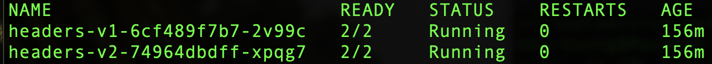
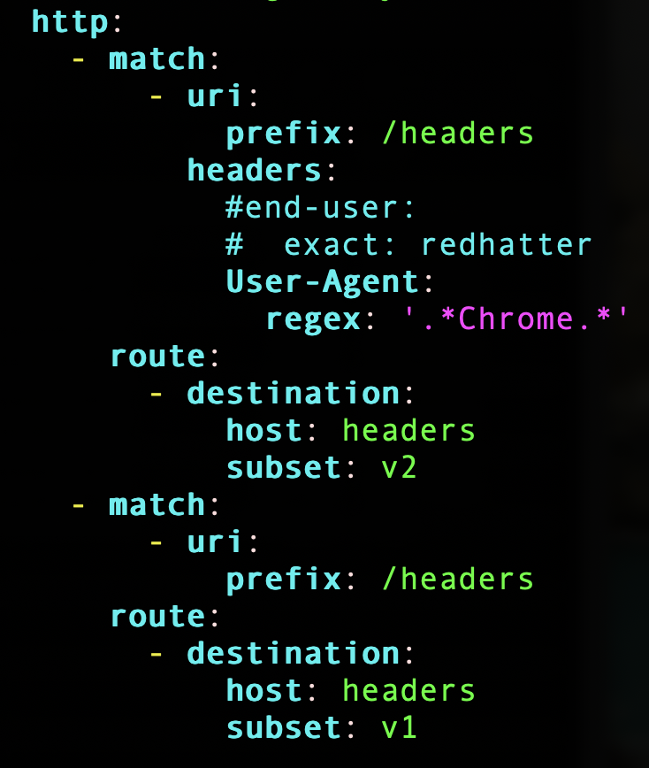

## Learning Objective
Using OSSM to route subset of users to particular version of application

## Prerequisites

- OCP 4.7+ (with tenant admin access)
- OSSM 2.1
- Service Mesh Control Plane
- Kiali

## Use Case Summary

Chrome browser users will see "Hello Red Hat!" version of the application.
Non-Chrome browser users will see "Hello World!" version of the application.

## Start Lab

Create a new project called "headers":

<pre class="notranslate"><code>oc new-project headers
</code></pre>

Add project to Service Mesh Member Roll:

<pre class="notranslate"><code>oc apply -f ServiceMeshMemberRoll.yaml -n headers
</code></pre>

Setup the application CRD's:

<UL>
<LI>Gateway: Uses istio-ingressgateway
<LI>VirtualService: Will be amended in later steps
<LI>Deployment: 
  - Sidecar injection is enabled 
  - v1 image: quay.io/redhattraining/ossm-maven-simplest:1.0 
  - v2 image: quay.io/redhattraining/ossm-maven-simplest:2.0 
</UL>

<pre class="notranslate"><code>oc apply -f application.yaml -n headers
</code></pre>

Verify the pods are running.  If you see 2 containers per pod, it means sidecar proxy injection is successful.

<pre class="notranslate"><code>oc get pods --watch -n headers
</code></pre>

Create Destination Rule.  It defines logical subsets for our v1 and v2 applications which will be used by Virtual Service for routing.

<pre class="notranslate"><code>oc get apply -f destination-rule.yaml -n headers
</code></pre>

Create Virtual Service.

<UL>
<LI>v2 routing logic: 
  - We are looking for HTTP Header called "User-Agent" which contains "Chrome" using regex 
  - If match, route to v2 subset which we defined earlier in Destination Rule
<LI>v1 routing logic: 
  - Default route if match not found
</UL>

Note: the match rule is interpreted and executed in sequential order as defined in the yaml

<pre class="notranslate"><code>oc get apply -f virtual-service-with-header-subsets.yaml -n headers
</code></pre>

## Test Execution

- Different browsers send own User-Agent value, for example: 
  - Chrome browser sends User-Agent: Mozilla/5.0 (Macintosh; Intel Mac OS X 10_15_7) AppleWebKit/537.36 (KHTML, like Gecko) Chrome/102.0.0.0 Safari/537.36
  - Firefox sends User-Agent: Mozilla/5.0 (Macintosh; Intel Mac OS X 10.15; rv:91.0) Gecko/20100101 Firefox/91.0
  
- Enter your {istio-ingressgateway.(your cluster domain)}/headers into your browser:
  - Using Chrome: you will see "Hello Red Hat!"
  - Using non-Chrome: you will see "Hello World!"
  
- You can experiment with more elaborate match/route logic by updating the VirtualService CRD
  - For example, you can look for custom HTTP headers with specific values, and route to versioned subsets depending on business needs
  - You can even combine traffic routing weights (as seen in our Canary Deployment lab) with header match logic
  
## Learning Summary

- Deploy versioned subsets of application
- Defined HTTP traffic matching rule and routing logic
- Performed simple test to verify match and routing logic performed as expected
- This powerful OSSM functionality can be expanded into advanced use cases for complex match and routing
  

