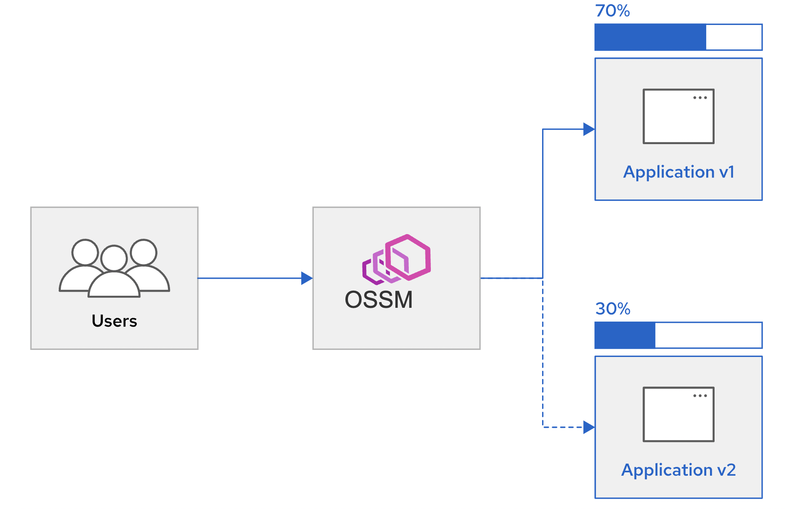
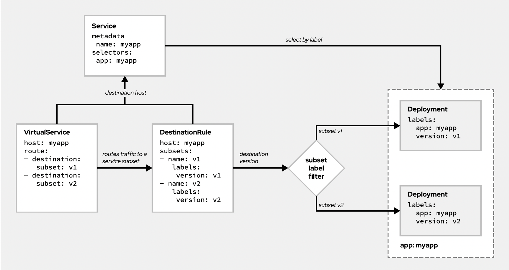
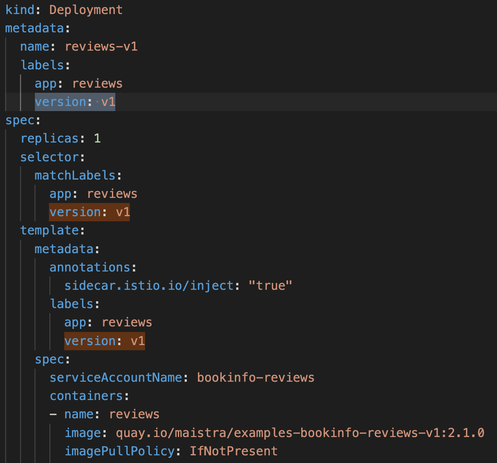
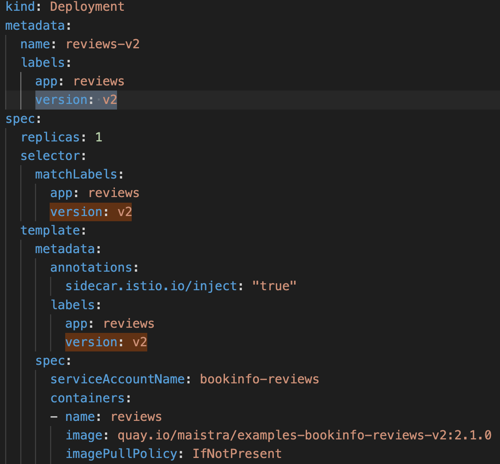
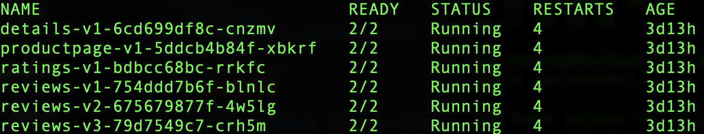
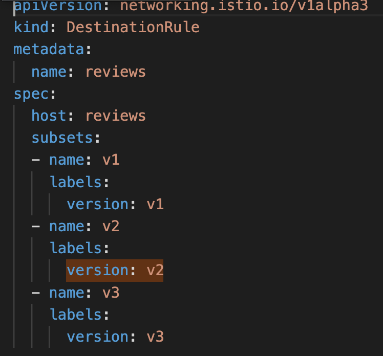
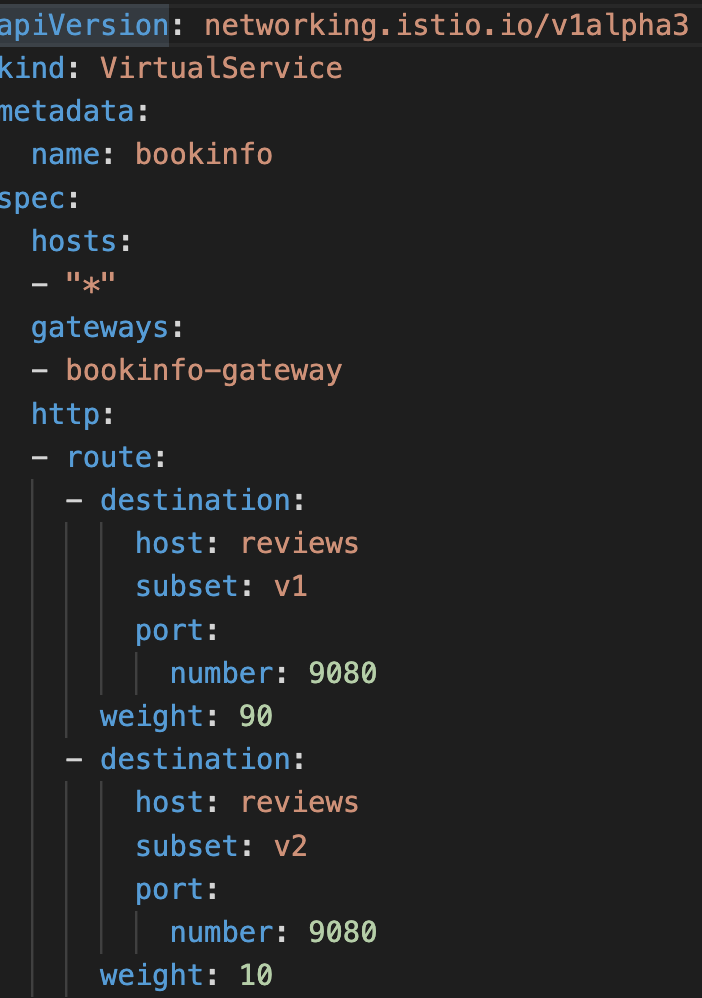

Objectives

This lab demonstrates release OSSM applications with a safe canary rollout.

Prerequisites

- OCP 4.7+ (tenant admin access)
- OSSM 2.1
-   Control Plane created and started
-   Service Mesh Member Roll (bookinfo enrolled)
-   Routes are up and running (istio-ingressgateway, Kiali)

Background

Traditional release model requires version rollback when defects are found.  
Canary release model solves this problem using a progressive deployment process where
both versions of the application, the previous and the current, run in parallel until the new version is
completely validated and ready for all users. 

The new version, called the "canary" initially receives only a small amount of all application traffic to minimize impact on limited set of users. 
As confidence level increases, the model progressively route more traffic to the new version.

Following diagram outlines at a very high level the Canary Release Model

Deploying a Canary Release

The following diagram shows the relationships between CRD's that are used for canary release model.
- Deployment
- Virtual Service
- Destination rule

- Deployment

This table shows snippet of v1 and v2 of the "reviews" Deployment of the bookinfo example

| v1 | v2 |
| ----------- | ----------- |
|  |  |

- Use a unique name for each versioned deployment, different from the name of the old deployment.
- Application label should match the old deployment, so that the service is aware that the new version belongs to the same application as the old version.
- Change the value of the version label so that OSSM can distinguish between versions when routing traffic.

<pre class="notranslate"><code>oc apply -f bookinfo.yaml -n bookinfo</code></pre>

If you have properly setup OSSM Control Plane, Member Roll, and bookinfo, you should see the following bookinfo pods up and running.
NOTE: each pod have 2 containers per pod, means that sidecar proxy has been injected properly

- Destination Rule

Create a DestinationRule CRD to define the subsets that represent each version

<pre class="notranslate"><code>oc apply -f destination-rule-all.yaml -n bookinfo</code></pre>

- Virtual Service

Create a VirtualService CRD to define the traffic routing for each version. 
Associate each subset with a route destination and add a weight.

There are two destination configurations defined in this virtual service, one for each
version. v1 receives 90% of the traffic, v2 receives the remaining 10%. 
Each destination must contain the following information:

- The service hostname. It must be the same as the host field defined in the destination rule.
- The name of one of the subsets defined in the associated destination rule
- The percentage of traffic routed to the version

<pre class="notranslate"><code>oc apply -f bookinfo-gateway-canary.yaml -n bookinfo</code></pre>

